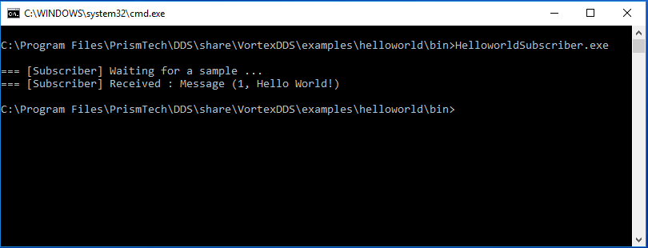

.. _`Installation`:

.. raw:: latex

    \newpage

#################
Install VortexDDS
#################

.. .. contents::

.. _`SystemRequirements`:

*******************
System requirements
*******************

Currently AdLink VortexDDS is supported on the following platforms:

+-------------------+--------------+--------------------+
| Operating systems | Architecture | Compiler           |
+===================+==============+====================+
| Ubuntu 16.04 LTS  | 64-bit       | gcc 5.4 or later   |
+-------------------+--------------+--------------------+
| Windows 10        | 64 -bit      | VS2015             |
+-------------------+--------------+--------------------+

*****
Linux
*****

Ubuntu
======

On Ubuntu and other debian-derived platforms, the product can be installed using a native package.

::

    sudo dpkg -i VortexDDS-<version>-Linux-lib.deb
    sudo dpkg -i VortexDDS-<version>-Linux-dev.deb

.. _`CopyLinuxExamplesToUserFriendlyLocation`:

Post install steps
~~~~~~~~~~~~~~~~~~

The installation package installs examples system directories.
In order to have a better user experience when building the VortexDDS
examples, it is advised to copy the examples to a user-defined location.
The installation package provides a script for this.

TODO vdds_install_examples in /usr/bin directory.

Red Hat
=======

Not supported yet (CHAM-326).

Tarball
=======

For more generic Linux installations, different tar-balls (with the same
content) are provided.

+----------------------------------+---------------------------------------+
| Tarball                          | Description                           |
+==================================+=======================================+
| VortexDDS-<version>-Linux.tar.Z  | Tar Compress compression.             |
+----------------------------------+---------------------------------------+
| VortexDDS-<version>-Linux.tar.gz | Tar GZip compression.                 |
+----------------------------------+---------------------------------------+
| VortexDDS-<version>-Linux.tar.sh | Self extracting Tar GZip compression. |
+----------------------------------+---------------------------------------+

By extracting one of them at any preferred location, VortexDDS can be used.

.. _`LinuxSetLibPath`:

Paths
=====

To be able to run VortexDDS executables, the required libraries (like
libvddsc.so) need to be available to the executables.
Normally, these are installed in system default locations and it works
out-of-the-box. However, if they are not installed in those locations,
it is possible that the library search path has to be changed.
This can be achieved by executing the command:
::

    export LD_LIBRARY_PATH=<install_dir>/lib:$LD_LIBRARY_PATH

*******
Windows
*******

.. _`WindowsInstallMSI`:

MSI
===

The default deployment method on Windows is to install the product using the MSI installer.

The installation process is self-explanatory. Three components are available:

1. a runtime component, containing the runtime libraries
2. a development component, containing the header files, the IDL compiler,
   a precompiled Hello Word! example and other examples.
3. an examples component, containing the source code of the VortexDDS examples.

The runtime and development components are (by default) installed in "Program Files" while
the VortexDDS example component will be installed in the User Profile directory.
The VortexDDS example code in the User Profile directory can be changed by the user.

ZIP
===

The Windows installation is also provided as a ZIP file. By extracting it
at any preferred location, VortexDDS can be used.

.. _`WindowsSetLibPath`:

Paths
~~~~~

To be able to run VortexDDS executables, the required libraries (like
vddsc.dll) need to be available to the executables.
Normally, these are installed in system default locations and it works
out-of-the-box. However, if they are not installed on those locations,
it is possible that the library search path has to be changed.
This can be achieved by executing the command:
::

    set PATH=<install_dir>/bin;%PATH%

.. note::
      The MSI installer will add this path to the PATH environment
      variable automatically.

.. _`TestYourInstallation`:

**********************
Test your installation
**********************

The installation provides a simple prebuilt :ref:`Hello World! <HelloWorld>` application which
can be run in order to test your installation. The *Hello World!* application consists of two
executables: a so called HelloworldPublisher and a HelloworldSubscriber, typically located in
:code:`/usr/share/VortexDDS/examples/helloworld/bin` on Linux and in
:code:`C:\Program Files\AdLink\DDS\share\VortexDDS\examples\helloworld\bin` on Windows.

To run the example application, please open two console windows and navigate to the appropriate
directory in both console windows. Run the HelloworldSubscriber in one of the console windows by the
typing following command:

  :Windows: :code:`HelloworldSubscriber.exe`
  :Linux: :code:`./HelloworldSubscriber`

and the HelloworldPublisher in the other console window by typing:

  :Windows: :code:`HelloworldPublisher.exe`
  :Linux: :code:`./HelloworldPublisher`

The output HelloworldPublisher should look like

.. image:: ../_static/pictures/HelloworldPublisherWindows.png

while the HelloworldSubscriber will be looking like this

For more information on how to build this application your own and the code which has
been used, please have a look at the :ref:`Hello World! <HelloWorld>` chapter.

*******
License
*******

TODO: CHAM-325

